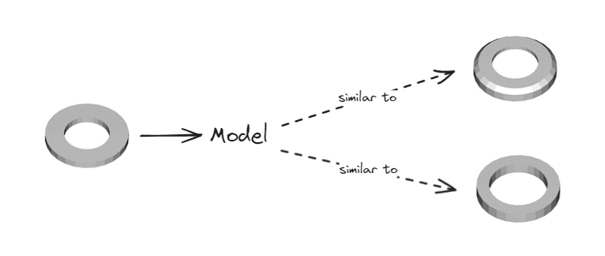
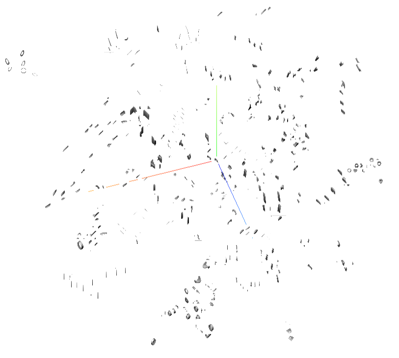

> **TL;DR:**
> - 🔍 Built a 3D similarity model for comparing CAD designs based on geometry despite limited labeled data, by fine-tuning a Transformer backbone.
> - 📱 Developed a "Tinder-like" app to gather human-labeled triplets for training with triplet loss.
> - 🏆 Transformer-based models outperformed Graph Neural Networks, showing better accuracy and rotation invariance.
> - 🔄 The iterative approach combining triplet generation, labeling, and retraining yields effective embeddings for design comparison.

The main goal here is to create a 3D similarity model that compares [Computer-Aided Designs (CAD)](https://en.wikipedia.org/wiki/Computer-aided_design) based on their geometry. This is crucial for managing huge CAD repositories, where finding the right design quickly can save time and spark new ideas.

**One major challenge is the scarcity of labeled data and the difficulty of assigning labels to CAD parts**. Different manufacturers may refer to something like a screw under various names, and conventions can differ greatly. That’s why a shape-based similarity model is essential. A custom “Tinder-like” application was built to gather labeled triplets for the training process.

## Method

The overall approach starts with collecting triplets through the user-friendly labeling app. Users pick which design is more similar to an anchor design, helping the model learn how to group similar shapes. The model uses [triplet loss](https://en.wikipedia.org/wiki/Triplet_loss) so that similar items end up close together in the embedding space, and very different ones stay apart.

**This process updates iteratively: train an initial model, generate triplets, get them labeled, retrain the model, and repeat**. Over time, it hones in on more challenging triplets, improving accuracy with limited labeled data.

## Experiments

Tests used 20,000 triplets and compared Graph Neural Networks (like [EdgeConv](https://arxiv.org/abs/1801.07829)) with Transformer-based models (like [OpenShape](https://arxiv.org/abs/2305.10764)). Key techniques included converting CAD meshes into graphs or point clouds, plus data augmentation (e.g., random rotations).

The Transformer models ended up outperforming the GNNs, showing better accuracy and improved rotation invariance. **Visual checks with t-SNE plots confirmed that the embeddings grouped similar designs**, though human judgment was still essential through the app.

## Conclusion

This work tackles 3D design comparison in settings with massive CAD libraries and little labeled data. **The best results came from an iterative method combining novel triplet generation, a labeling tool, and Transformer backbone architecture**. Immediate applications include automated design optimization and CAD integration for suggesting improvements. 

For more details about this work, check out [the full report](https://github.com/accoumar12/report-d3s/blob/main/main.pdf) or [contact me](https://portfolio.accoumar.fr//#contact) !