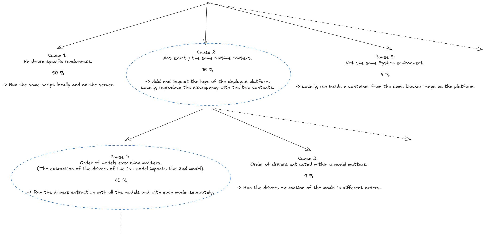
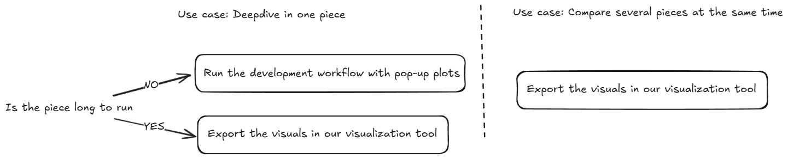

> **TL;DR:**
> - 🔍 Start by reproducing the bug locally with a small test case;
> - ⚠️ Take error and warning messages seriously, even in systems with known issues;
> - 🌳 Create a hypothesis tree with mutually exclusive potential causes and concrete evaluation methods;
> - 🛠️ Choose the right debugging tools (debugger vs logger) based on the specific bug characteristics.

Finding the root cause of complex bugs can be a frustrating experience. Recently, I had to track down several challenging bugs that required a systematic approach. This post outlines the methodology I wish I had followed from the beginning, which would have saved me a lot of time and effort.

## The systematic approach 🧩

### 1. Reproduce locally 🔄

**Always start by reproducing the bug locally, ideally with a small test case**. This step is crucial yet often overlooked. If reproduction isn't possible locally, that itself is a valuable clue – the issue might be environment or hardware-specific.

A common mistake is jumping into debugging without confirming we can reproduce the problem. This leads to wasted time and incorrect assumptions about the bug's nature.

Once you have a reproducible case, simplify it as much as possible. Eliminating all the irrelevant noise often sheds light on the real cause. This case should also be easily iterable, allowing for quick tests and modifications.

### 2. Identify when it worked (for regressions) ⏱️

If dealing with a regression bug (something that used to work but now doesn't):

- Find the last commit where the functionality worked correctly;
- Use [git bisect](https://git-scm.com/docs/git-bisect) to efficiently identify the exact commit that introduced the bug;
- If bisecting isn't possible with tests, manually check out commits to find the breaking point.

### 3. Pay Attention to Error Messages 📝

**Don't ignore error or warning messages**, even in systems where some errors are expected. This may seem obvious, but it's easy to dismiss messages in codebases with known issues. **Every error and/or warning should be understood and its origin identified**.

### 4. Create a Hypothesis Tree 🌲

Lay out different possible causes as a tree structure. Aim for causes that are:
- Collectively exhaustive (covering all possibilities);
- Mutually exclusive (distinct from each other).
This is not always easy, especially at the beginning of a debugging session, but it's crucial to operate as efficiently as possible.

Assign each cause a probability of being the root cause. This helps prioritize which branches to investigate first.

Here is an example of a hypothesis tree for a bug I encountered, where different models extracted various drivers (like the number of holes or area) with discrepancies between the platform and our 3D analytics library:

For each potential cause, define a concrete method to evaluate it. Sometimes, a single test can evaluate multiple causes simultaneously. For example, in the tree above, Cause 1 and Cause 3 on the first line can be evaluated by running a test script directly with the Docker image on the platform server.

At each step, you narrow down the potential causes based on the results of your evaluations. This methodical approach helps avoid jumping to conclusions and ensures you consider all possibilities. You should end up with the line or portion of code responsible for the bug !

## Deep diving a cause 🔬

For each cause, start deep diving into the code. Your best tools here are the debugger and the logger. Each has its strengths and weaknesses, and you should be comfortable using both.

1. **The debugger** 🐛: Useful for stopping execution at specific points, especially when an error occurs. Be careful, though – the debugger can sometimes lead you down rabbit holes if you're not careful. Also, it can be misleading sometimes if the code uses some "magic" behavior. For example, I was debugging a codebase where the core class was overiding the `__getattribute__` method. This would cause chain reactions when opening the debug panel...

2. **The logger** 📊: Excels when you have good metrics to track. In one case where topology visualization appeared in different locations, logging the centroid coordinates helped me pinpoint exactly when and why the shift occurred.
Additionally, you can take a creative approach to logging. For example, while working on a 3D analytics library in Python, we implemented a system that automatically captured 3D visualizations during function execution. This was achieved using a decorator called `displayable` applied to key functions. The workflow made it easy to track changes over time in a visual format. Instead of digging through complex and often unclear textual logs, we could simply run two instances side by side and visually identify where the differences occurred.

3. **Domain-specific tools**:  Each domain can have its own best practices for debugging. For example, working with 3D CAD data requires a different approach than debugging web applications or backend services. **Understanding the domain and the tools available is crucial**.
As I am a big fan of mental decision tree. Here is the one I apply when working with 3D CAD data.

## Conclusion 🏁

The hardest part of fixing bugs is almost always finding and understanding them – not implementing the fix. **Reproducing the bug can be challenging, but it's an essential first step**.

Interestingly, in my experience, our initial hypothesis about the cause is rarely correct. The systematic approach outlined here helps overcome our biases and leads to the true root cause more efficiently.