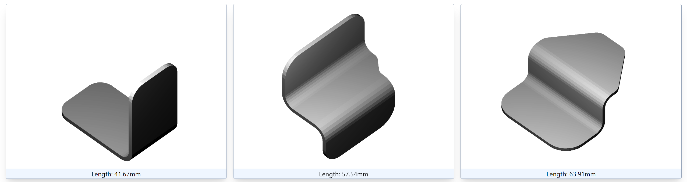

> **TL;DR:**
> - Simple but effective data locking strategy for a multi-user labeling application.
> - The solution handles edge cases where users disconnect before completing the labeling process.
> - This approach avoids complex database locking mechanisms while maintaining data integrity.

## Context


During my master's thesis, I developed a "Tinder-like" application where users swiped left or right to select the piece most similar to the one in the center. This application was essential to build a labeled triplet dataset for training a 3d similarity model with a triplet loss. 

**One of the critical aspect of the app was to handle the labeling of a triplet by a given user**. The labeling process had to follow this fundamental locking property:

> Each triplet needed to be labeled only once, meaning a labeled triplet should not be presented to another user.

## Solution

Without using any advanced database mechanisms, the initial solution involved adding a new boolean attribute to the data called `is_retrieved`. This attribute defaulted to `False` and was set to `True` whenever the data was retrieved by a user. 

While this approach ensures that a triplet is not presented to more than one user, it is not perfect. It does not account for situations where a user disconnects or logs out before labeling the triplet, leaving it unlabeled. These scenarios are referred to as *edge cases*.

To handle such situations, **a timeout value was introduced**. If a triplet remains in the labeling process for longer than the timeout period, it is considered an *edge case*, and the triplet is returned to the unlabeled triplets group.

```python
def get_first_unlabeled_triplet(
    db: Session,
    lock_timeout_in_seconds: int = config.lock_timeout_in_seconds,
) -> Triplet:
    now_time = datetime.datetime.now(datetime.timezone.utc)
    # We define the timeout as the current time minus the lock_timeout_in_seconds, so the boundary, cutoff below which the triplet is considered as "unlabeled", "stale".
    cutoff_time = now_time - datetime.timedelta(
        seconds=lock_timeout_in_seconds,
    )
    # We retrieve the first triplet that is unlabeled and either has never been retrieved or has been retrieved before the cutoff time.
    triplet = (
        db.query(Triplet)
        .filter(
            (Triplet.label.is_(None))
            & ((Triplet.retrieved_at.is_(None)) | (Triplet.retrieved_at < cutoff_time)),
        )
        .first()
    )
    if triplet:
        triplet.retrieved_at = now_time
        db.commit()
    return triplet
```

This basic solution largely meets our needs. Although some users may take longer than the timeout period to label, causing a triplet to be labeled twice, such occurrences would be very rare.

A more advance solution could use database-level locking mechanisms such as [row-level locks](https://asktom.oracle.com/ords/asktom.search?tag=select-for-update-skip-locked) to ensure that only one user can retrieve and label a triplet at a time.